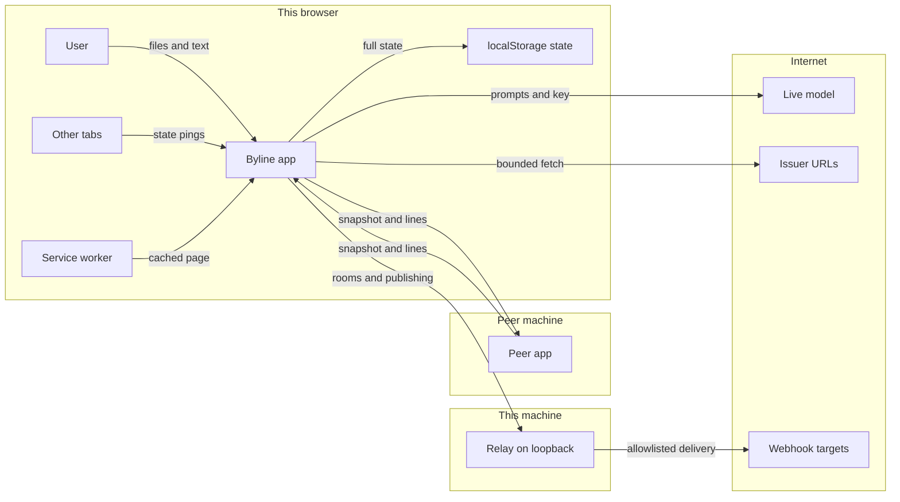

# Byline — threat model

Produced 2026-09-11 with the `security-threat-model` skill (openai/skills), built from the code rather than from the hand-written `THREAT-MODEL.md`. Line numbers are approximate and drift with edits; symbol names are the stable anchor.

## Executive summary

> **Status, end of the day:** every row below is now fixed, or fixed with a stated residual. TM-011 turned out worse than rated: the live-model path skipped authority entirely. The `file://` question was measured: Chrome shares one storage area across local files.
> **Status, later still:** TM-004, TM-005 and TM-007 are fixed and TM-003 is partly fixed (see their rows), each proven by a test that failed first and by mutations. Open: TM-003's optional lock and the `file://` question, TM-006, and TM-008 to TM-011.

> **Status, 2026-09-11 (later the same day):** TM-001 and TM-002 are **fixed**. Both directions of peer sync are now an allow-list (`SHARED_RECORD`, `publicState`, the snapshot merge in `applyPeerOp`), proven by two tests that failed against the unfixed code and by four mutations that each turned them red. That fix also surfaced TM-012 (the record is replaced, not merged), which is now **fixed** as well — differently from the mitigation recommended below: not a union of the two logs, which cannot be one valid chain, but two witnesses. Ours is never taken from a peer; theirs is kept beside it, verified, and every later copy is held to the last like an anchor. Every other row stands as written below.

Byline's cryptography is in good shape: signing is WebCrypto ECDSA P-256, script injection is closed by a hash-only CSP plus escape-first rendering, and the last three passes bound every identity to its key. The top risks are now in **what the peer connection carries and accepts outside of identities**. A snapshot sent to a peer is the whole state with only private keys and the lock removed, so the **Anthropic API key, the relay token and the wallet — every SD-JWT disclosure included — go to the peer** (TM-001). Coming back, the merge copies every top-level field of the peer's copy onto ours, so a semi-trusted colleague can **re-point the model and relay at their own server and plant a scheduled workflow**, giving them a continuing feed of unpublished desk content and lines filed and signed under your byline (TM-002). Secondary themes: private keys and the API key sit in `localStorage` in the clear unless the optional lock is turned on (TM-003), and anybody a peer introduces can root a chain of authority (TM-005). These findings come from reading the code; none has yet been reproduced in a running browser, and doing that is the first step of any fix.

## Scope and assumptions

**In scope (runtime):** `byline.html` (the whole application, one inline script), `byline-sw.js` (service worker), `interop/byline-relay.mjs` (optional relay), `interop/public-address.mjs` (the relay's address classifier).

**Out of scope:** the `verify*.mjs` harnesses, `relay-test.mjs`, and the Python tooling (`run-suite.py`, `preflight.py`, `dev.py`, `counts.py`, `deliver.py`, `csp-hash.py`), which are dev/CI only and never ship to a reader; the smoke-test code inside `byline.html` except where a URL can trigger it (TM-010); `byline-landing.html`, which is static marketing with a local demo signature.

**Context confirmed by the owner:**
- Risk is ranked **for both deployments, separately**: the **downloaded file** (opened locally or served on a LAN, with a real model key, a relay and real peers) and the **hosted artifact** (a claude.ai page whose outbound HTTP is blocked by the host).
- A peer is **semi-trusted**: a colleague you chose to connect to, who may share the record but must not get your keys or secrets, or be able to change your settings or anyone's identity.
- The relay stays on **loopback only**, which is its default (`server.listen(PORT, '127.0.0.1', …)`, `interop/byline-relay.mjs` ~285).

**Assumptions (not confirmed):**
- Desk content is sensitive: unpublished copy, sources, internal discussion.
- WebRTC peer connections work on the hosted artifact. The host blocks HTTP, not necessarily RTCPeerConnection. If they do not work, the hosted rows for TM-001, TM-002 and TM-005 drop to low.
- A fully compromised browser and malicious extensions are out of scope.

**Open questions that would change the ranking:**
1. Does Chromium share one `localStorage` origin across all `file://` pages? If it does, any local HTML file opened in Chrome can read Byline's keys (TM-003 rises to high for the downloaded file). Firefox isolates `file://` origins by default. This needs a two-file test, not an assumption.
2. Do verifiers enforce any freshness on a hosted status list? If not, whoever can PUT to the relay can replay an older list, signed by you, and un-withdraw credentials (TM-008).
3. Will the relay ever be exposed beyond loopback, so rooms work across networks? That raises TM-004 and TM-008 to high.

## System model

### Primary components
- **Byline app** — one HTML file with one inline script. It holds the whole state `S` (people, keys, desks, lines, record, wallet, settings, workflows) and persists it to `localStorage` through `save()`. It signs with WebCrypto, issues and verifies credentials (VC, VC-JWT, SD-JWT VC, OpenID4VP, OpenID4VCI), runs correspondents on canned replies or a live model, runs a YAML workflow engine, syncs across tabs over `BroadcastChannel`, and syncs with a peer over a WebRTC DataChannel. Evidence: `byline.html` — `save`, `issueVC`, `verifyVC`, `runWorkflows`, `initSync`, `wirePeer`, `applyPeerOp`.
- **Service worker** — network-first cache of same-origin GETs, registered only when served over http(s). Evidence: `byline-sw.js`.
- **Relay (optional)** — a Node HTTP server on `127.0.0.1`. It offers unauthenticated rooms for signalling, a hosted status-list and did:web store (bearer token only if one is configured), and a webhook forwarder (`POST /deliver`: token if configured, host allowlist, public-address pinning). Evidence: `interop/byline-relay.mjs` — `server`, `authorised`, `resolvePublic`, `deliverTo`.
- **External parties** — a live model (Ollama at a user-set URL, or `api.anthropic.com` called straight from the browser), did:web hosts and status-list hosts chosen by credential issuers, webhook targets, and STUN servers for WebRTC.

### Data flows and trust boundaries
- **User → App** (typing; files: key file, masthead file, Slack export; pasted peer codes, OpenID4VP requests and OpenID4VCI offers). Data: text, JSON files, credential requests. Channel: DOM events, FileReader. Guarantees: masthead files are shape-checked by `workspaceProblem` and a `confirm()` dialog before they replace everything; key files go through `adoptKeyFile`, which derives the identifier from the key and refuses a mismatched public key; requests are verified by `verifyRequest`, whose signature must match the `client_id`.
- **App ↔ localStorage.** Data: the entire state, including private JWKs, the API key and the relay token. Guarantees: optional AES-GCM wrapping of private keys under a passphrase or a WebAuthn PRF passkey (`lockKeys`, `unlockKeys`), **off by default** ("Private keys are stored in the clear"). The API key and relay token are never wrapped.
- **App ↔ Peer app (WebRTC DataChannel, DTLS).** Data: `hello`, `snapshot` (from `publicState()`), `message`, `reaction`. Guarantees: transport encryption; **no peer authentication** (the name in `hello` is self-asserted); incoming state is shape-normalised by `hydrate`; private keys are stripped both ways (`OFF_WIRE`); identities are protected (`bindDid`, `KEY_FIELDS`, `followHandovers`, own identity never described). **Not filtered: `settings`, `workspace` (relay URL and token), `workflows`, `webhooks`, `wallet` — out or in.**
- **App ↔ Relay (HTTP, `Access-Control-Allow-Origin: *`).** Data: SDP offers and answers, status-list credentials, DID documents, webhook jobs. Guarantees: rate limit of 120 requests a minute per IP, 256 KB body cap, room codes `^[A-Z0-9]{4,12}$` with first writer winning and a 15-minute TTL; publishing and delivery need a bearer token **only if `BYLINE_RELAY_TOKEN` is set**.
- **Relay → webhook targets (HTTP/S).** Data: templated workflow bodies (desk text). Guarantees: host allowlist (`BYLINE_RELAY_HOOKS`, empty by default), DNS resolved and pinned to a public address, redirects not followed, 64 KB response cap, deadline.
- **App → live model.** Data: system and user prompts built from desk history (`buildPrompt`), and the API key in a header. Channel: `fetch` to `settings.live.url` (Ollama) or `https://api.anthropic.com/v1/messages` with `anthropic-dangerous-direct-browser-access`. Guarantees: none on the destination; it is whatever the settings say.
- **App → issuer-chosen URLs (did:web documents, status lists).** Channel: `fetchBounded` GET with a 2 MB and 12 s ceiling; did:web is https only, status lists http or https. Guarantees: a document's `id` must match the did it was fetched for; fail closed.
- **App ↔ other tabs of the same app (`BroadcastChannel` `byline.sync`).** Data: presence and "state changed" pings, which trigger `pullState` re-reading storage. Same origin only.
- **URL → test runner.** `?test=1` runs the smoke suite against a parked copy of the masthead; `&report=<url>` POSTs results to any URL.

#### Diagram

## Assets and security objectives

| Asset | Why it matters | Security objective (C/I/A) |
|---|---|---|
| Private signing keys (every person's `jwk`, pre-rotation `nextJwk`) | Whoever holds one files lines and issues credentials that verify as that byline | C, I |
| Anthropic API key (`settings.live.key`) | Billed usage and access to the owner's API account | C |
| Relay bearer token (`workspace.relayToken`) | Publishes status lists and DID documents, and triggers webhook delivery | C, I |
| Desk content: lines, galleys, record, and the prompts built from them | Unpublished copy and sources | C |
| Integrity of the signed record (bylines, hash-chained events, anchors) | The product's whole claim: who said what, provably | I |
| Identity bindings (did ↔ key, retired keys, revocations) | A wrong binding makes a forgery verify or an honest line fail | I |
| Authority (delegation credentials, trusted roots) | Decides what a correspondent may do | I |
| Wallet credentials, including SD-JWT disclosures | Personal claims; selective disclosure is only worth anything while undisclosed claims stay withheld | C |
| Local settings: model URL, relay URL, workflows, experiment flags | Decide where content goes and what runs on a timer | I |
| Relay's durable store (status lists, DID documents) | Verifiers elsewhere rely on it for revocation and did:web keys | I, A |
| The masthead in storage | One browser profile is the only copy unless it is exported | A |

## Attacker model

### Capabilities
- **A semi-trusted peer** can send any JSON over the DataChannel (`snapshot`, `message`, `reaction`) and read everything we send them.
- **Someone who sends you a file or a request** — a masthead file, a key file, a Slack export, a credential, an OpenID4VP request or an OpenID4VCI offer. Opening it is the user's action.
- **A credential issuer** chooses the did:web host and the status-list URL your browser will fetch when it verifies their credential.
- **A local party** — another OS user, malware, or another local HTML page (the `file://` question) — can read browser storage.
- **Someone who learns a room code**, if they can reach the relay.
- **Anyone who gets you to open a link to your own Byline** with query parameters (`?test=1&report=`).

### Non-capabilities
- Running script in Byline's origin: `script-src` allows only the inline script's hash, and message text is escaped before any formatting is applied (`fmtText`). An injected `<script>`, an event handler or a `javascript:` URL does not run.
- Reaching the relay from another machine, with the relay on loopback as confirmed.
- Reading the DataChannel without being the peer (DTLS).
- Forging ECDSA signatures, or making a did:key name a different key (bound since the last pass: `jwkFromDidKey` on-curve check, `didOfJwk` and `bindDid`).
- On the hosted artifact: making outbound HTTP from the page, so no model, relay, did:web or webhook traffic.

## Entry points and attack surfaces

| Surface | How reached | Trust boundary | Notes | Evidence (repo path / symbol) |
|---|---|---|---|---|
| Peer `snapshot` | DataChannel message | Peer → App | Merges every top-level field onto `S`; identities protected, settings/workspace/workflows/wallet not | `byline.html` `applyPeerOp` (~2600), `Object.keys(theirs).forEach(k => { S[k] = theirs[k]; })` (~2642) |
| Snapshot we send | `wirePeer` on open | App → Peer | `publicState()` strips people's `OFF_WIRE` fields and `lock` only | `byline.html` `publicState` (~2584) |
| Peer `message` / `reaction` | DataChannel | Peer → App | New author learned public-only and bound; text escaped on render | `applyPeerOp` message branch; `fmtText` |
| Masthead file import | Settings → import | User file → App | Shape check + `confirm()`, then replaces the entire state | `workspaceProblem`, `importWorkspace` (~5912) |
| Key file import | Settings → import | User file → App | Identifier derived from key; mismatch refused | `adoptKeyFile`, `importKey` |
| Slack export import | Import dialog | User files → App | Parsed JSON, filed under a system byline | `importSlack` path (~6100) |
| OpenID4VP request / OpenID4VCI offer | Pasted text | External party → App | Signature bound to `client_id`; the verifier is shown before anything is presented | `verifyRequest` (~1618), `vciParseOffer` |
| Credential verification | Wallet, desks, pasted VC | Issuer → App | Key from the did; did:web and status lists fetched | `verifyVC`, `resolveKeyJwk`, `remoteStatus` (~1800), `fetchBounded` (~986) |
| Live model call | A correspondent is @mentioned | App → Model | Destination and key come from `settings.live` | `LIVE_CFG` (~4145), `ollamaChat`, `/v1/messages` call (~4270) |
| Workflows (YAML) | Desk wire editor; schedule tick every 20 s | App → Relay → Webhooks; App → own desk | `webhook` and `post` steps; `post` files lines as `S.meId` | `runWorkflows` (~4784), `scheduleTick`, `execWorkflow` |
| Relay rooms | `POST`/`GET /rooms/:code/(offer\|answer)` | Anyone who can reach the relay | No token; first writer wins; 15-minute TTL | `interop/byline-relay.mjs` rooms branch (~190) |
| Relay publishing | `PUT /status/:id`, `PUT /did/:name` | Relay client → Relay | Token only if configured; the relay "hosts, does not judge" | `authorised` (~148), status PUT (~219), did PUT (~235) |
| Relay delivery | `POST /deliver` | Relay → Internet | Token if configured; allowlist; public-address pinning | `resolvePublic`, `deliverTo`, `interop/public-address.mjs` |
| Other tabs | `BroadcastChannel` | Same origin | Triggers a re-read of storage only | `initSync` (~2447) |
| Test-mode URL | `?test=1&report=<url>` | Link → App → any URL | Runs the suite; POSTs UA, counts and failure text | `boot` (~10099), report POST (~10004), watchdog beacon (~7424) |
| Service worker | Page load over http(s) | Network → cache | Network first; same-origin GETs only | `byline-sw.js` |

## Top abuse paths

1. **Take the owner's API key and wallet.** Peer connects → `wirePeer` sends `publicState()` → the peer reads `settings.live.key`, `workspace.relayToken` and `wallet` (every SD-JWT with every disclosure) from the first message → billed API use on the owner's account, and every claim selective disclosure was supposed to withhold.
2. **A continuing feed of unpublished copy.** Peer sends a snapshot whose `settings.live` names `provider: 'ollama'` and a `url` they control → next time any correspondent is @mentioned, `buildPrompt` sends the desk's history there → every later exchange leaks, with no visible change beyond replies coming from somewhere else.
3. **Lines in your name on a timer.** Peer's snapshot sets `settings.experiments.workflows = true` and adds a workflow `{on: {event: schedule, every: 15m}, steps: [{post: {text: …}}]}` → `scheduleTick` runs it while your tab is open → `execWorkflow` files the text with `authorId: S.meId`, signed by your key → the record shows you saying it, correctly signed. This works on the hosted artifact too.
4. **Exfiltration through webhooks.** Same planted workflow with a `webhook` step, plus a `workspace.relay` pointing at the peer's own server → the app POSTs `{url, body}` with templated desk text and your relay token to it (on the downloaded file).
5. **Authority from nowhere.** Peer introduces a human (new id, their own key) → that person issues a root delegation to a correspondent → `verifyDelegation` finds a human with that did in `S.people` and accepts the chain as local (`foreign: false`) → that correspondent files under authority the owner never granted.
6. **A colleague's past made to fail.** Peer sets a first `revokedAt` on a colleague this masthead has not revoked, dated earlier → `verifyReal` returns false for their lines after that time → a colleague's honest record now reads as unverified.
7. **Become the peer.** Attacker learns a room code (read aloud, or from a shared screen) and can reach the relay → `POST /rooms/CODE/answer` before the real colleague → the host connects to the attacker → paths 1–4 follow. Only reachable with an exposed relay.
8. **Swap the whole masthead.** A "shared masthead" file is sent to the user → import, confirm → `S = hydrate(j)` replaces people, keys, settings and workflows → the user now files under an identity whose private key the sender holds, and runs the sender's workflows and model URL.

## Threat model table

| Threat ID | Threat source | Prerequisites | Threat action | Impact | Impacted assets | Existing controls (evidence) | Gaps | Recommended mitigations | Detection ideas | Likelihood | Impact severity | Priority |
|---|---|---|---|---|---|---|---|---|---|---|---|---|
| TM-001 | Semi-trusted peer | A peer connection was opened | Reads secrets and wallet from the snapshot `publicState()` sends on connect | API key abuse; SD-JWT disclosures and wallet claims exposed; relay token exposed (harmless while the relay is on loopback) | API key, relay token, wallet | Private keys and lock stripped (`OFF_WIRE`, `publicState`) | `settings`, `workspace.relayToken`, `wallet`, `webhooks` sent verbatim | Replace `publicState()` with an **allowlist** of shared top-level fields (`workspace.name`, `channels`, `messages`, `people` public, `events`, `proposals`); never send `settings`, `wallet`, `webhooks`, `workflows`, `lock`, or `workspace.relay`/`relayToken`. Add a test that walks the sent object for any key in a deny-list | Record a `peer.snapshot.sent` event listing the top-level fields sent | High — happens on every connect, with no action needed from the peer | High — key and wallet exposure | **Fixed** 2026-09-11 (was file high, hosted medium) |
| TM-002 | Semi-trusted peer | Connected; sends one crafted snapshot | Overwrites `settings.live`, `workspace.relay`/`relayToken`, `settings.experiments`, `workflows` through the top-level merge | Continuing exfiltration of desk content to peer-chosen endpoints; lines filed and signed as the owner on a timer | Desk content, record integrity, local settings | Identity fields protected (`KEY_FIELDS`, `bindDid`, `followHandovers`); lines merged without duplication (`mergeLines`) | `Object.keys(theirs).forEach(k => S[k] = theirs[k])` accepts every other field | Merge only an **allowlist** of shared fields; keep `settings`, `workspace.relay*`, `workflows`, `webhooks`, `wallet` and `lock` local, full stop. Workflows that `post` should sign with a workflow identity, not `S.meId`. Test: a snapshot carrying settings/workflows changes nothing local | Diff local settings before and after every snapshot and toast any change; log `workflow.created` with its origin | Medium — needs intent, but is trivial to do | High — silent, persistent, and signed in your name | **Fixed** 2026-09-11 (was file high, hosted medium); a local workflow's `post` still signs as the owner, which is now only the owner's own doing |
| TM-003 | Local party (other OS user, malware, another local page) | Read access to the browser profile or origin storage; the lock is off (the default) | Reads `localStorage`: every private JWK, the API key, the relay token | Every byline impersonated; API key abuse | Private keys, API key, relay token | Optional passphrase/passkey wrapping of private keys (`lockKeys`, `unlockKeys`); non-extractable key cache once unwrapped (`_priv`) | Off by default; the API key and relay token are never wrapped; `file://` origin sharing in Chromium is unverified | Offer the lock during onboarding; wrap `settings.live.key` and `workspace.relayToken` under the same KEK; verify the Chromium `file://` question and document it | Settings shows "stored in the clear" (it does); log `identity.exported` (it does) | Medium | High | **Fixed** 2026-09-11 — secrets wrapped with the keys; the `file://` question measured (Chrome shares, Firefox does not), so any `file://` page is treated as shared: the lock is offered at every launch and warned about until taken; over the web, declining is a recorded choice |
| TM-004 | Network-adjacent party who learns a room code | Can reach the relay; knows or guesses the code before the colleague answers | Posts the answer first and becomes the peer | Everything in TM-001, TM-002 and TM-005 | Same as those | Rate limit; codes of 4–12 characters, 6 random from a 32-letter alphabet (`roomCode`); first writer wins; TTL; DTLS | No peer authentication: `hello` is self-asserted and the SDP fingerprint is never compared out of band | Show a short fingerprint derived from both DTLS fingerprints on each side and ask for it to be compared; bind the room to a one-time secret carried with the code | Toast who connected and their key's short fingerprint | Low — relay on loopback | High | **Fixed** 2026-09-11 — a code from both DTLS fingerprints is compared before anything syncs; residual: certificate grinding by an attacker in the middle of both code exchanges |
| TM-005 | Semi-trusted peer | Connected | Introduces a human who then roots delegations | Correspondents act on authority the owner never granted | Authority | Chains are verified end to end: subset-only scope, depth cap, parent must name the issuer (`verifyDelegation`) | Any human in `S.people` is a local root | Make "can root authority here" an explicit, local, per-person flag that a peer cannot set; treat peer-introduced people as foreign roots until the owner says otherwise | Log `delegation.root` with whether the root was introduced by a peer | Medium | Medium | **Fixed** 2026-09-11 — `canRoot`: only people whose key is held here, or whom the owner names, root authority |
| TM-006 | Semi-trusted peer | Connected; the colleague has no revocation here yet | Sends a first `revokedAt`, backdated | A colleague's honest lines stop verifying here | Record integrity, identity bindings | An existing revocation cannot be lifted or moved (`applyPeerOp`) | A first revocation is taken as data | Take revocations only as a signed statement from the key itself, or from a root this masthead trusts; otherwise show it as a claim, not a verdict | Record `key.revoked` with who asserted it | Low | Medium | **Fixed** 2026-09-11 — revocations are signed statements by the key itself or a root here; a peer's word is not taken |
| TM-007 | Anyone who sends the user a file | User imports a masthead file and confirms the replacement | The file supplies people, keys, `meId`, settings and workflows | The user files under a key the sender holds; the sender's workflows and model URL run | Everything local | `workspaceProblem` shape check; `confirm()` naming the masthead | The confirm does not say what changes — whose keys, which model URL, which workflows | Show a pre-import summary (identity you will become and whether its private key came in the file; model and relay destinations; enabled workflows) and import settings/workflows only on an explicit tick | Log `workspace.imported` with the destinations it brought | Low | High | **Fixed** 2026-09-11 — `workspaceImportPlan` shows what changes; settings and workflows come in only when ticked |
| TM-008 | Local process, or anyone holding the relay token | Can reach the relay | PUTs an older, validly signed status list over the hosted one, or a DID document | Withdrawn credentials read as live again, if verifiers accept stale lists | Relay store, revocation | `NAME` regex; the list must be a signed `BitstringStatusListCredential`; the did document's `id` must match its address; token if set | No token by default; the relay "hosts, does not judge", so a replayed list is accepted | Require `BYLINE_RELAY_TOKEN` whenever publishing is enabled; refuse a list whose `validFrom` is older than the one held; have `remoteStatus` require `validUntil`/`ttl` freshness | Relay logs every PUT with source and `validFrom` | Low — loopback | Medium | **Fixed** 2026-09-11 — a token is always required (made and printed if unset); older and undated lists refused |
| TM-009 | Credential issuer | The user verifies a credential that issuer made | Picks the did:web host and status URL the browser will fetch | The issuer learns when and from where a credential was checked; blind GET to a LAN address (http allowed for status lists) | Desk privacy; LAN | `fetchBounded` ceilings (2 MB, 12 s); did:web https only; fail closed | Status lists may be `http:`; no user notice before an outbound fetch | Allow only `https:` for status lists outside a relay the user configured; show "checking with <host>" | Log each remote status fetch with host and credential | Medium | Low | **Fixed** 2026-09-11 — `fetchPolicy`: https only, no loopback/private/link-local unless it is your own relay; residual: names that resolve privately |
| TM-010 | Anyone who sends the user a link | The user opens `…byline.html?test=1&report=<url>` | Runs the smoke suite; POSTs UA, counts and failure text to any URL | Minor disclosure; a run that dies is recovered from the parked copy at boot | Availability of the masthead (low) | The masthead is parked and restored; the suite runs on its own seed | `report` is honoured for any origin | Honour `report` only for loopback addresses, or behind a confirm | — | Low | Low | **Fixed** 2026-09-11 — `reportAllowed`: the page's own server, or this machine |
| TM-011 | Author of any line a live-model correspondent reads | A live model is on; the line reaches `buildPrompt` | Prompt injection steers a correspondent's reply | Misleading copy filed under the correspondent's byline (correctly signed, correctly attributed to the agent) | Record content | Correspondents act only when @mentioned; filing is gated by delegation (`effectiveAuthority`); the byline says which agent | Output is not reviewed before filing unless the correspondent is set to "asks first" | Default live-model correspondents to "asks first" (proposals) | Mark lines produced by a live model; count proposals released without edits | Medium | Low | **Fixed** 2026-09-11 — and worse than rated: the live path never consulted authority or policy at all; it now does, and holds live copy unless the owner chose "files directly" |
| TM-012 | Semi-trusted peer | Connected | Sends a snapshot whose `events` differ from ours; the allow-listed merge assigns them wholesale | Our record of what happened is replaced by theirs: entries dropped, reordered or rewritten, with a chain that is internally consistent | Record integrity | Hash-chained events (`logEvent`); anchors kept outside the browser, which a peer can no longer overwrite | `events` merged by replacement, not union | Merge the record as a union keyed by event id, verifying each event's chain link and signature; refuse a peer copy that drops events we hold | On every snapshot, compare our chain head with the merged one and record `record.diverged` if an event we held is missing | Medium | High | **Fixed** 2026-09-11 (was file high, hosted medium) — `keepPeerRecord`; the record is no longer taken from a peer |
| TM-013 | Semi-trusted peer; anyone who sends a masthead file | Connected, or the file is imported | Sends a desk, line or person whose identifier or colour closes an HTML attribute, or a reaction that is markup | Markup the peer chose in the page — a false verification chip, a covered control, a link; the CSP blocks script | Record integrity as the reader sees it | Text escaped by `fmtText`/`esc`; hash-only CSP | Identifiers and colours inserted unescaped; reactions drawn raw | Checked at the door (`SAFE_ID`, `SAFE_COLOR`, `okEmoji` in `hydrate` and `applyPeerOp`) and escaped at every sink | Count elements the page did not create (the test does) | Medium | Medium | **Fixed** 2026-09-11 — found by the audit after the Buzz comparison, not by this model |

## Criticality calibration

- **Critical** — a remote party with no relationship to the owner gets private signing keys, or can make arbitrary lines verify as any byline. Examples: script injection into the Byline origin; a did:key that verifies with a key it does not name (fixed last pass); a peer receiving private JWKs (fixed two passes ago).
- **High** — a party the owner chose to connect to, or a file they chose to open, gets secrets, redirects content, or acts in the owner's name. Examples: TM-001 (API key and wallet to a peer); TM-002 (model URL, relay and workflows rewritten by a peer); TM-004 with the relay exposed.
- **Medium** — needs local access or a user decision, or its effect is limited to authority or verification status rather than keys. Examples: TM-003 (keys in the clear locally); TM-005 (peer-introduced authority roots); TM-007 (swapping a masthead through a file).
- **Low** — narrow disclosure, loopback-only reach, or effects the user can see and undo. Examples: TM-008 with the relay on loopback; TM-009 (issuer learns you checked); TM-010 (test-mode report link).

## Focus paths for security review

| Path | Why it matters | Related Threat IDs |
|---|---|---|
| `byline.html` — `publicState` (~2584) | Decides what leaves the machine on every peer connection; currently a deny-list of two things | TM-001 |
| `byline.html` — `applyPeerOp` snapshot merge (~2600–2650) | The one place a peer's data becomes ours; the final top-level assignment is the root of TM-002 | TM-002, TM-005, TM-006 |
| `byline.html` — `runWorkflows`, `scheduleTick`, `execWorkflow` (~4784–4870) | Runs YAML on a timer, posts as the owner, and forwards to webhooks | TM-002 |
| `byline.html` — `LIVE_CFG`, `buildPrompt`, `ollamaChat`, the Anthropic call (~4145–4290) | Sends desk history and the API key to a destination held in settings | TM-002, TM-011 |
| `byline.html` — `save`, `lockKeys`, `unlockKeys`, `_priv` (~2030–2130) | Keys at rest; what is wrapped and what is not | TM-003 |
| `byline.html` — `verifyDelegation` (~1912–1950) | What counts as a root of authority | TM-005 |
| `byline.html` — `importWorkspace`, `workspaceProblem` (~5912–5935) | Wholesale state replacement from a file | TM-007 |
| `byline.html` — `remoteStatus`, `fetchBounded`, `resolveDidWeb` (~986–1045, ~1800–1830) | Outbound fetches to issuer-chosen URLs; freshness of status lists | TM-008, TM-009 |
| `byline.html` — `wirePeer`, `peerHost`, `peerJoin`, `relayJoin` (~2490–2560, ~2700–2730) | Peer establishment with no authentication | TM-004 |
| `byline.html` — the 71 `innerHTML` assignments in application code | The XSS barrier is escape-first discipline plus CSP; worth a sweep for any interpolation missing `esc()` | (defence of all) |
| `byline.html` — `boot`, test report (~10004, ~10099) | URL-triggered test run and outbound POST | TM-010 |
| `interop/byline-relay.mjs` | Unauthenticated rooms, optional token, hosted lists "not judged" | TM-004, TM-008 |
| `interop/public-address.mjs` | SSRF classification for delivery; any gap re-opens LAN reach | TM-008 |
| `byline-sw.js` | Serves a cached build when the network fails; stale builds have misled testing before | (availability) |

## Quality check

- **Entry points covered:** peer snapshot, message and reaction; masthead, key and Slack imports; OpenID4VP/VCI; credential verification and outbound fetches; live model; workflows and schedule; relay rooms, publishing and delivery; other tabs; test-mode URL; service worker.
- **Every trust boundary appears in at least one threat:** Peer ↔ App (TM-001, 002, 005, 006), User file → App (TM-007), App ↔ storage (TM-003), App ↔ Relay (TM-004, 008), App → issuer URLs (TM-009), App → model (TM-002, 011), URL → test runner (TM-010). Other tabs are same-origin and carry only a re-read ping, so no threat is listed for them.
- **Runtime and dev separated:** harnesses and Python tooling are excluded; the only in-file test code considered is what a URL can trigger.
- **Owner clarifications reflected:** both deployments ranked separately; peers semi-trusted; relay on loopback.
- **Assumptions and open questions:** listed under Scope and assumptions. The three that move rankings are Chromium `file://` storage, status-list freshness, and relay exposure.

**Compared with the hand-written `THREAT-MODEL.md`:** that document covers keys on the wire, identity binding, relay SSRF and the masthead file. TM-001's API key, relay token and wallet leak; TM-002's settings, relay and workflow overwrite; TM-005's authority roots as a peer consequence; TM-010; and TM-011 are new here.
